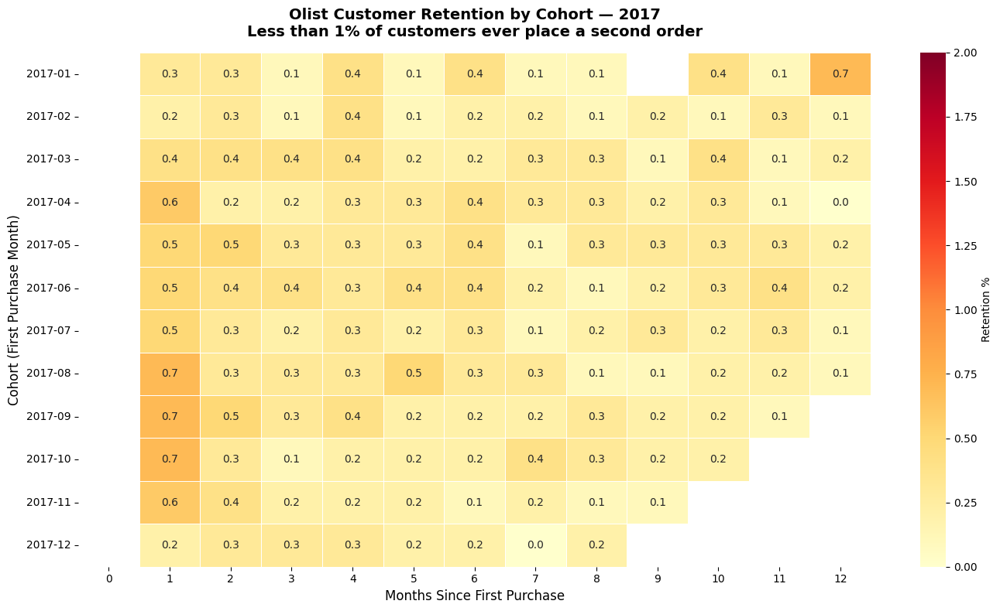
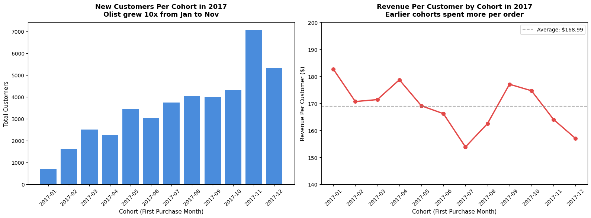
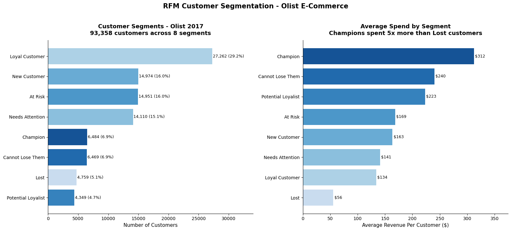
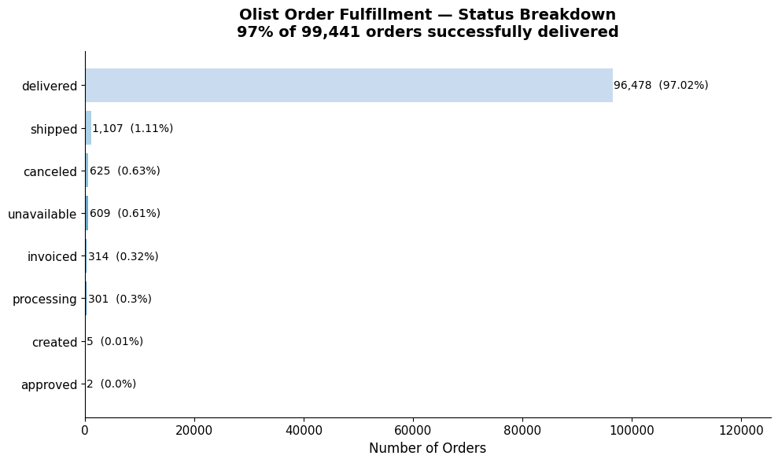
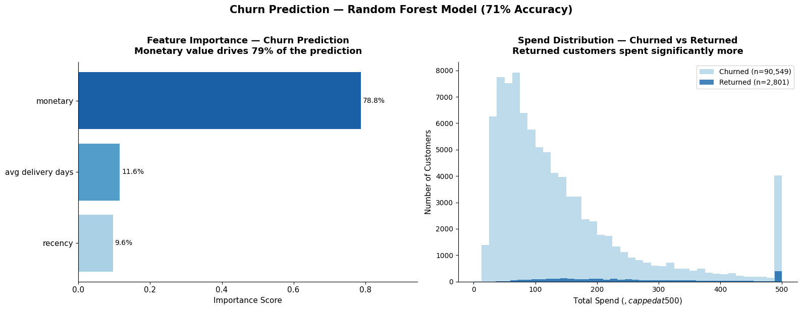

# Olist Customer Analytics - Cohort, RFM & Churn


---

Olist is a Brazilian e-commerce marketplace connecting small retailers to customers across Brazil. This project runs five analyses on 99,441 real orders to answer the questions that matter most to the business: who are our customers, are they coming back, which ones are most valuable, and which ones are about to disappear?

---

## The Dataset

Four CSV files from Kaggle's [Olist Brazilian E-Commerce dataset](https://www.kaggle.com/datasets/olistbr/brazilian-ecommerce):

| File | What it contains | Rows |
|------|-----------------|------|
| `olist_orders_dataset.csv` | Every order - status, timestamps, delivery dates | 99,441 |
| `olist_customers_dataset.csv` | Customer IDs, city, state | 99,441 |
| `olist_order_items_dataset.csv` | Items per order - price, seller, product | 112,650 |
| `olist_order_payments_dataset.csv` | Payment method and value per order | 103,886 |

One important quirk: the customers table has both `customer_id` and `customer_unique_id`. One real person can have multiple `customer_id` values across orders. Everything here uses `customer_unique_id` — the stable identifier for an actual human.

---

## Finding 1 - Cohort Retention

**Do customers come back?**



Short answer: almost never. Less than 1% of customers place a second order in any given month after their first purchase. The heatmap is almost uniformly yellow - there's no cohort that retains meaningfully better than any other.

This isn't a failure of the product. It's the nature of the business. Olist sells furniture, appliances, and electronics - things people buy once every few years, not every month. The business model is entirely dependent on acquiring new customers, not retaining them.

That single insight reframes everything else in this analysis.

---

## Finding 2 - Revenue by Cohort

**Which customers were most valuable?**



Two things stand out. First, Olist grew fast - from 717 new customers in January 2017 to 7,060 in November, nearly 10x in a single year. Second, that growth came at a cost. Earlier cohorts spent an average of $182 per order. By December 2017 that had dropped to $157. As Olist scaled acquisition, average order value declined.

The implication: Olist's growth strategy was working on volume but the quality of acquired customers was declining. A product analyst watching this in real time would flag it.

---

## Finding 3 — RFM Segmentation

**Who are our customers really?**



RFM scores every customer on three dimensions - how recently they bought (Recency), how often (Frequency), and how much (Monetary) - then segments them into actionable groups.

Key findings across 93,358 customers:

| Segment | Customers | Avg Spend | What to do |
|---------|-----------|-----------|------------|
| Champion | 6,484 (6.9%) | $312 | Reward and retain |
| Cannot Lose Them | 6,469 (6.9%) | $240 | Re-engage immediately - gone 470 days |
| At Risk | 14,951 (16%) | $169 | Win-back campaign |
| Lost | 4,759 (5.1%) | $56 | Write off or low-cost reactivation |

The most urgent group is **Cannot Lose Them** - 6,469 high-value customers who spent $240 on average but haven't been seen in 470 days. They're not technically lost yet, but they're close. A targeted re-engagement campaign for this segment is the highest-ROI marketing action available.

---

## Finding 4 — Order Fulfillment

**Does delivery quality affect retention?**



97% of orders are successfully delivered. The 1.2% problem rate (canceled + unavailable) is low but worth monitoring - at 99,441 orders that's 1,234 customers who had a bad experience.

More interesting: delivery speed shows up as the second most important predictor in the churn model below. Slow delivery doesn't just frustrate customers - it predicts they won't return.

---

## Finding 5 - Churn Prediction

**Can we predict who won't come back?**



A Random Forest classifier trained on three features - monetary value, average delivery days, and recency predicts churn with 71% accuracy. That's meaningful signal from just three variables.

Feature importance:

| Feature | Importance |
|---------|-----------|
| Monetary value | 78.8% |
| Avg delivery days | 11.6% |
| Recency | 9.6% |

How much a customer spent is by far the strongest predictor of whether they'll ever return. The spend distribution chart on the right makes this visual returned customers cluster at higher spend values while churned customers concentrate at the low end.

The practical use of this model: score every new customer at their first purchase. High spenders with fast delivery → prioritize for re-engagement campaigns. Low spenders with slow delivery → lower re-engagement investment.

---

## The Business Story

Five analyses, one consistent story:

> Olist is a high-growth, acquisition-dependent marketplace where almost no customer ever buys twice. Growth is real (10x in one year) but average order value is declining as scale increases. The customers most worth fighting for are the 6,469 high-value accounts who've gone dark in the last 470 days. Delivery speed is the one operational lever that meaningfully predicts whether a customer returns.

---

## Notebooks

```
olist-customer-analytics/
├── README.md
├── screenshots/
│   ├── cohort_retention_heatmap.png
│   ├── cohort_revenue.png
│   ├── rfm_segments.png
│   ├── order_fulfillment.png
│   └── churn_prediction.png
└── notebooks/
    └── olist_customer_analytics.ipynb
```

---

## How to Reproduce

1. Download the dataset from [Kaggle](https://www.kaggle.com/datasets/olistbr/brazilian-ecommerce)
2. Open [Google Colab](https://colab.research.google.com) — free, no setup
3. Upload the four CSV files listed above
4. Run the notebook top to bottom

Required libraries - all pre-installed in Colab:
```
pandas, numpy, matplotlib, seaborn, scikit-learn
```

---

## Python Concepts Used

| Concept | Where used |
|---------|-----------|
| `pd.merge` | Join orders + customers + payments |
| `groupby + transform` | Assign cohort dates to every row |
| `dt.to_period('M')` | Extract month from timestamp |
| `pivot_table` | Build cohort retention matrix |
| `pd.qcut` | Score customers into RFM quintiles |
| `resample` | Balance imbalanced churn classes |
| `RandomForestClassifier` | Predict churn |
| `classification_report` | Evaluate model performance |

---

Built by **Rohith Reddy Thumma** — Product Analyst, MS Business Analytics @ NAU (GPA 4.0, Distinction, May 2026).

[Portfolio](https://veritas-ui-eight.vercel.app) · [LinkedIn](https://linkedin.com/in/rohithreddythumma) · rohiththumma2001@gmail.com

---

*Part of a broader analytics portfolio including a SQL investigation into Yammer's WAU drop, a production Power BI retention dashboard (20,941 NAU students), and a 1st-place transit analytics capstone.*
